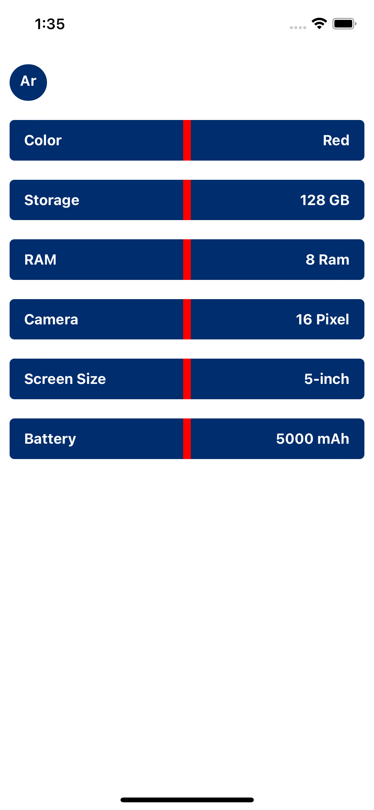
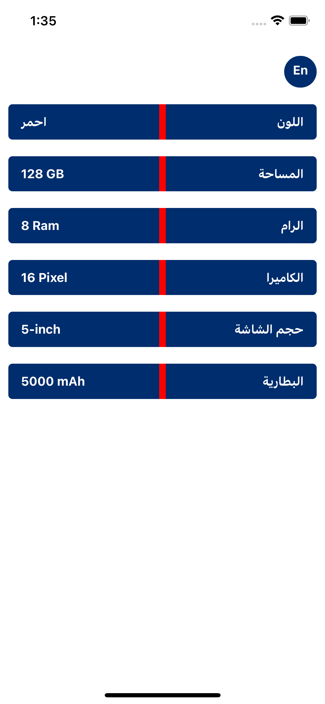

# Translation Mobile App React Native Cli

## Description

This is [React Native Project].

It is a Translation Test Project for Ios and Android App using i18n-js.

The app is built with React Native and was developed and tested for **IOS && Android**.

### Running the application

`$ npm install`

This application is build using a tool by [React-Native-Cli] .
If you want to run the application on your Android device, Install the React-Native-Cli from the npm
And run using `npx react-native start` && `npx react-native run-android` && `npx react-native run-ios` .

### ScreenShot

  
  

